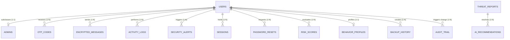

# Database Design Document: GSM Data Protection System

This document outlines the relational database architecture for the AI-powered GSM Data Protection Platform. The schema is normalized to **Third Normal Form (3NF)** and optimized for performance, security, and integrity under MySQL/MariaDB.

---

## 1. Entity-Relationship Diagram (ERD) & Logical Model

The following Mermaid diagram visualizes the entity relationships, illustrating foreign key mappings, cardinality (e.g., 1:N, 1:1), and behavioral logging structures.

### Relationship Design & Cardinality
1.  **`users` $\to$ `admins` (1:1):** Subclass relationship. To maintain 3NF, specialized administrative parameters (like permissions and access groups) are separated from the main user identities.
2.  **`users` $\to$ `otp_codes` (1:N):** A single user can have multiple historical OTP codes, but each code belongs to exactly one user.
3.  **`users` $\to$ `encrypted_messages` (1:N):** A user can send multiple encrypted GSM envelopes. Mapped using `sender_id`.
4.  **`users` $\to$ `sessions` / `password_resets` (1:N):** Standard session state and authentication tokens tracking.
5.  **`threat_reports` $\to$ `ai_recommendations` (1:N):** AI logs threat incidents in `threat_reports`. Multiple mitigation recommendations can map to a single incident report.

---

## 2. Third Normal Form (3NF) Normalization Proof

To verify that the database satisfies 3NF standards, we analyze the structure against three stages of normalization:

### First Normal Form (1NF)
*   **Requirement:** Atomic values per column, no repeating groups or multi-valued attributes, and uniquely identifiable rows.
*   **Proof:** Every table contains a unique Primary Key (e.g., `id`). Structural attributes (like `behavior_profiles` subnets or IP logs) are atomic. Multi-value profiles are split into separate columns.

### Second Normal Form (2NF)
*   **Requirement:** Must be in 1NF, and all non-prime attributes must be fully functionally dependent on the entire primary key (no partial dependencies).
*   **Proof:** Since all tables use single-column auto-incrementing integer keys (or unique session IDs), composite keys are avoided. Thus, partial dependencies on key subsets are mathematically impossible.

### Third Normal Form (3NF)
*   **Requirement:** Must be in 2NF, and no non-prime attributes may contain transitive dependencies on the primary key (no non-prime attribute depends on another non-prime attribute).
*   **Proof:** 
    *   *Separation of `admins`:* Placing administrative clearance variables in `users` would create transitive dependencies (since administrative levels depend on the user's role, which is a non-prime attribute). Separating them into the `admins` subclass table solves this.
    *   *Separation of `ai_recommendations`:* A recommendation depends on the threat classification category, which in turn depends on the report ID. To prevent transitive dependencies, recommendation details are split into `ai_recommendations` referencing `threat_reports`.

---

## 3. Data Dictionary

### 3.1 `users` Table
Stores authentication credentials and account statuses.

| Column | Data Type | Nullability | Constraints | Default | Description |
| :--- | :--- | :--- | :--- | :--- | :--- |
| `id` | INT | NOT NULL | PRIMARY KEY, AUTO_INCREMENT | | Unique User Identifier |
| `username` | VARCHAR(50) | NOT NULL | UNIQUE, INDEX | | Unique login username |
| `email` | VARCHAR(100) | NOT NULL | UNIQUE, INDEX | | System notifications email |
| `password_hash` | VARCHAR(255) | NOT NULL | | | Bcrypt password hash |
| `status` | VARCHAR(20) | NOT NULL | CHECK (status IN ('active', 'suspended')) | 'active' | Operational status |
| `created_at` | TIMESTAMP | NOT NULL | | CURRENT_TIMESTAMP | Date of registration |

### 3.2 `admins` Table
Admin subclass table (1:1 mapping with `users`).

| Column | Data Type | Nullability | Constraints | Default | Description |
| :--- | :--- | :--- | :--- | :--- | :--- |
| `id` | INT | NOT NULL | PRIMARY KEY, AUTO_INCREMENT | | Unique admin record ID |
| `user_id` | INT | NOT NULL | UNIQUE, FOREIGN KEY (users.id) ON DELETE CASCADE | | User reference |
| `access_level` | VARCHAR(30) | NOT NULL | | 'moderator' | Admin clearance level |
| `updated_at` | TIMESTAMP | NOT NULL | | CURRENT_TIMESTAMP | Date of last clearance change |

### 3.3 `otp_codes` Table
Validates multi-factor OTP tokens.

| Column | Data Type | Nullability | Constraints | Default | Description |
| :--- | :--- | :--- | :--- | :--- | :--- |
| `id` | INT | NOT NULL | PRIMARY KEY, AUTO_INCREMENT | | Record ID |
| `user_id` | INT | NOT NULL | FOREIGN KEY (users.id) ON DELETE CASCADE | | Owner User Reference |
| `code_hash` | VARCHAR(255) | NOT NULL | | | Bcrypt-hashed OTP code |
| `expires_at` | TIMESTAMP | NOT NULL | | | Token expiration time |
| `verified` | TINYINT(1) | NOT NULL | CHECK (verified IN (0, 1)) | 0 | Verification state flag |
| `created_at` | TIMESTAMP | NOT NULL | | CURRENT_TIMESTAMP | Generation timestamp |

### 3.4 `encrypted_messages` Table
Tracks GSM encrypted payloads (formerly `gsm_messages`).

| Column | Data Type | Nullability | Constraints | Default | Description |
| :--- | :--- | :--- | :--- | :--- | :--- |
| `id` | INT | NOT NULL | PRIMARY KEY, AUTO_INCREMENT | | Message envelope identifier |
| `sender_id` | INT | NOT NULL | FOREIGN KEY (users.id) ON DELETE CASCADE | | Creator reference |
| `recipient` | VARCHAR(20) | NOT NULL | INDEX | | Recipient MSISDN |
| `encrypted_payload` | TEXT | NOT NULL | | | AES-256 ciphertext |
| `iv` | VARCHAR(64) | NOT NULL | | | Cipher initialization vector |
| `salt` | VARCHAR(64) | NOT NULL | | | Key derivation salt |
| `signature` | VARCHAR(64) | NOT NULL | | | HMAC integrity hash |
| `created_at` | TIMESTAMP | NOT NULL | | CURRENT_TIMESTAMP | Time of transmission |

### 3.5 `activity_logs` Table
Audits standard user panel events.

| Column | Data Type | Nullability | Constraints | Default | Description |
| :--- | :--- | :--- | :--- | :--- | :--- |
| `id` | INT | NOT NULL | PRIMARY KEY, AUTO_INCREMENT | | Log identifier |
| `user_id` | INT | NULL | FOREIGN KEY (users.id) ON DELETE SET NULL | NULL | Operator reference |
| `action` | VARCHAR(100) | NOT NULL | | | Name of event (e.g. login) |
| `ip_address` | VARCHAR(45) | NOT NULL | | | Connection IP source |
| `user_agent` | VARCHAR(255) | NOT NULL | | | Client User-Agent string |
| `created_at` | TIMESTAMP | NOT NULL | | CURRENT_TIMESTAMP | Event timestamp |

### 3.6 `security_alerts` Table
Records critical WAF and AI warnings.

| Column | Data Type | Nullability | Constraints | Default | Description |
| :--- | :--- | :--- | :--- | :--- | :--- |
| `id` | INT | NOT NULL | PRIMARY KEY, AUTO_INCREMENT | | Alert identifier |
| `user_id` | INT | NULL | FOREIGN KEY (users.id) ON DELETE SET NULL | NULL | Associated user |
| `severity` | VARCHAR(15) | NOT NULL | CHECK (severity IN ('low', 'medium', 'high', 'critical')) | | Incident severity level |
| `message` | TEXT | NOT NULL | | | Threat warning text |
| `status` | VARCHAR(20) | NOT NULL | CHECK (status IN ('open', 'resolved', 'ignored')) | 'open' | Investigation status |
| `created_at` | TIMESTAMP | NOT NULL | | CURRENT_TIMESTAMP | Alert timestamp |

### 3.7 `sessions` Table
Stores hardened user sessions.

| Column | Data Type | Nullability | Constraints | Default | Description |
| :--- | :--- | :--- | :--- | :--- | :--- |
| `id` | VARCHAR(128) | NOT NULL | PRIMARY KEY | | Secure session hash identifier |
| `user_id` | INT | NULL | FOREIGN KEY (users.id) ON DELETE CASCADE | NULL | User reference |
| `ip_address` | VARCHAR(45) | NOT NULL | | | Connection IP |
| `user_agent` | VARCHAR(255) | NOT NULL | | | Browser User-Agent |
| `payload` | TEXT | NOT NULL | | | Serialized session variables |
| `last_activity` | INT | NOT NULL | INDEX | | Unix timestamp of last hit |

### 3.8 `password_resets` Table
Manages password recovery tokens.

| Column | Data Type | Nullability | Constraints | Default | Description |
| :--- | :--- | :--- | :--- | :--- | :--- |
| `id` | INT | NOT NULL | PRIMARY KEY, AUTO_INCREMENT | | Token ID |
| `user_id` | INT | NOT NULL | FOREIGN KEY (users.id) ON DELETE CASCADE | | User reference |
| `token_hash` | VARCHAR(255) | NOT NULL | UNIQUE | | Hashed recovery token |
| `expires_at` | TIMESTAMP | NOT NULL | | | Expiration timestamp |
| `created_at` | TIMESTAMP | NOT NULL | | CURRENT_TIMESTAMP | Creation date |

### 3.9 `login_attempts` Table
Tracks failed logins for rate limiting.

| Column | Data Type | Nullability | Constraints | Default | Description |
| :--- | :--- | :--- | :--- | :--- | :--- |
| `id` | INT | NOT NULL | PRIMARY KEY, AUTO_INCREMENT | | Log ID |
| `ip_address` | VARCHAR(45) | NOT NULL | INDEX | | Origin IP address |
| `username` | VARCHAR(50) | NOT NULL | | | Submitted username |
| `status` | VARCHAR(15) | NOT NULL | CHECK (status IN ('success', 'failed', 'blocked')) | | Attempt status |
| `attempt_time` | TIMESTAMP | NOT NULL | | CURRENT_TIMESTAMP | Attempt timestamp |

### 3.10 `threat_reports` Table
Logs security threat incidents.

| Column | Data Type | Nullability | Constraints | Default | Description |
| :--- | :--- | :--- | :--- | :--- | :--- |
| `id` | INT | NOT NULL | PRIMARY KEY, AUTO_INCREMENT | | Report ID |
| `threat_classification` | VARCHAR(100) | NOT NULL | | | AI Threat classification category |
| `description` | TEXT | NOT NULL | | | Telemetry details |
| `ip_address` | VARCHAR(45) | NOT NULL | | | Attacking source IP |
| `severity` | VARCHAR(15) | NOT NULL | CHECK (severity IN ('low', 'medium', 'high', 'critical')) | | Event severity level |
| `created_at` | TIMESTAMP | NOT NULL | | CURRENT_TIMESTAMP | Incident log timestamp |

### 3.11 `ai_recommendations` Table
Maps mitigation actions to threat reports.

| Column | Data Type | Nullability | Constraints | Default | Description |
| :--- | :--- | :--- | :--- | :--- | :--- |
| `id` | INT | NOT NULL | PRIMARY KEY, AUTO_INCREMENT | | Recommendation ID |
| `threat_report_id` | INT | NOT NULL | FOREIGN KEY (threat_reports.id) ON DELETE CASCADE | | Incident reference |
| `recommendation_text` | TEXT | NOT NULL | | | AI mitigation advice |
| `priority` | VARCHAR(10) | NOT NULL | CHECK (priority IN ('low', 'medium', 'high')) | 'medium' | Mitigation priority |
| `created_at` | TIMESTAMP | NOT NULL | | CURRENT_TIMESTAMP | Generation timestamp |

### 3.12 `risk_scores` Table
Stores historical user risk ratings.

| Column | Data Type | Nullability | Constraints | Default | Description |
| :--- | :--- | :--- | :--- | :--- | :--- |
| `id` | INT | NOT NULL | PRIMARY KEY, AUTO_INCREMENT | | Rating record ID |
| `user_id` | INT | NOT NULL | FOREIGN KEY (users.id) ON DELETE CASCADE | | User reference |
| `score` | INT | NOT NULL | CHECK (score BETWEEN 0 AND 100) | 0 | Risk percentage |
| `calculated_at` | TIMESTAMP | NOT NULL | | CURRENT_TIMESTAMP | Scoring date |

### 3.13 `behavior_profiles` Table
Stores user behavioral baseline data.

| Column | Data Type | Nullability | Constraints | Default | Description |
| :--- | :--- | :--- | :--- | :--- | :--- |
| `id` | INT | NOT NULL | PRIMARY KEY, AUTO_INCREMENT | | Profile identifier |
| `user_id` | INT | NOT NULL | UNIQUE, FOREIGN KEY (users.id) ON DELETE CASCADE | | User reference |
| `avg_login_frequency` | DECIMAL(5,2) | NOT NULL | | 1.00 | Average logins per day |
| `typical_ip_subnet` | VARCHAR(50) | NOT NULL | | | Most common subnet |
| `typical_user_agent` | VARCHAR(255) | NOT NULL | | | Most common browser UA |
| `updated_at` | TIMESTAMP | NOT NULL | | CURRENT_TIMESTAMP ON UPDATE CURRENT_TIMESTAMP | Last baseline recalculation |

### 3.14 `system_settings` Table
Stores global application settings.

| Column | Data Type | Nullability | Constraints | Default | Description |
| :--- | :--- | :--- | :--- | :--- | :--- |
| `id` | INT | NOT NULL | PRIMARY KEY, AUTO_INCREMENT | | Setting ID |
| `setting_key` | VARCHAR(50) | NOT NULL | UNIQUE | | Unique setting parameter key |
| `setting_value` | TEXT | NOT NULL | | | Parameter value |
| `updated_at` | TIMESTAMP | NOT NULL | | CURRENT_TIMESTAMP ON UPDATE CURRENT_TIMESTAMP | Last modification date |

### 3.15 `backup_history` Table
Logs administrative database backups.

| Column | Data Type | Nullability | Constraints | Default | Description |
| :--- | :--- | :--- | :--- | :--- | :--- |
| `id` | INT | NOT NULL | PRIMARY KEY, AUTO_INCREMENT | | Backup ID |
| `filename` | VARCHAR(255) | NOT NULL | | | Name of SQL dump file |
| `filesize` | VARCHAR(30) | NOT NULL | | | File size |
| `created_by` | INT | NULL | FOREIGN KEY (users.id) ON DELETE SET NULL | NULL | Admin reference |
| `created_at` | TIMESTAMP | NOT NULL | | CURRENT_TIMESTAMP | Backup execution date |

### 3.16 `audit_trail` Table
Logs low-level database table updates.

| Column | Data Type | Nullability | Constraints | Default | Description |
| :--- | :--- | :--- | :--- | :--- | :--- |
| `id` | INT | NOT NULL | PRIMARY KEY, AUTO_INCREMENT | | Audit record ID |
| `table_name` | VARCHAR(50) | NOT NULL | | | Name of updated table |
| `record_id` | INT | NOT NULL | | | Primary key of modified row |
| `action_type` | VARCHAR(10) | NOT NULL | CHECK (action_type IN ('INSERT', 'UPDATE', 'DELETE')) | | Database operation |
| `old_values` | TEXT | NULL | | NULL | JSON string of old data |
| `new_values` | TEXT | NULL | | NULL | JSON string of new data |
| `performed_by` | INT | NULL | FOREIGN KEY (users.id) ON DELETE SET NULL | NULL | Admin/operator reference |
| `created_at` | TIMESTAMP | NOT NULL | | CURRENT_TIMESTAMP | Operation timestamp |

---

## 4. Optimization Strategies

### 4.1 Indexing Strategy
To optimize database performance, indexes are defined on columns frequently used in `WHERE`, `JOIN`, `ORDER BY`, and `GROUP BY` operations:
*   `users(username)` & `users(email)`: Speeds up operator lookups during login.
*   `encrypted_messages(recipient)`: Optimizes lookups for GSM recipient tracking.
*   `sessions(last_activity)`: Enables fast identification and cleanup of expired sessions.
*   `login_attempts(ip_address, attempt_time)`: Optimizes rate limiter checks.

### 4.2 Cascading Rules
*   `ON DELETE CASCADE`: Used for dependent operational tables (`otp_codes`, `sessions`, `password_resets`, `risk_scores`, `behavior_profiles`, `admins`). If a user account is deleted, all their associated session and security tokens are automatically deleted to maintain database cleanliness.
*   `ON DELETE SET NULL`: Used for audit logs (`activity_logs`, `security_alerts`, `backup_history`, `audit_trail`). If an operator is deleted, their action history is preserved for compliance auditing, with the user reference set to `NULL` (System).

### 4.3 Database Configurations (InnoDB Tuning)
For optimal performance under standard MySQL/MariaDB engines:
- `innodb_buffer_pool_size`: Set to 70-80% of total system RAM on dedicated database servers to keep active indexes and rows in memory.
- `innodb_flush_log_at_trx_commit = 1`: Guarantees ACID compliance by flushing log buffers to disk on every transaction.
- `innodb_file_per_table = ON`: Ensures individual tables store data in separate `.ibd` files, simplifying recovery and optimization.

---

## 5. Database Security Considerations

- **Least Privilege Access:** The application connects using a dedicated database user account with permissions restricted to `SELECT`, `INSERT`, `UPDATE`, and `DELETE` on the `gsm_security` database. `DROP` or `ALTER` privileges are restricted to administrative tasks.
- **SQL Injection Defense:** All database queries are executed using strictly prepared statements. Input parameters are bound separately, preventing execution of malicious SQL inputs.
- **Bcrypt Hashing:** Passwords and OTP codes are hashed using **bcrypt** before storage. If the database is compromised, the hashes cannot be reversed back to raw credentials.
- **Ciphertext Integrity:** Encrypted payloads are stored with their corresponding Initialization Vector (IV) and HMAC signature. This ensures the ciphertext cannot be tampered with or manipulated.
